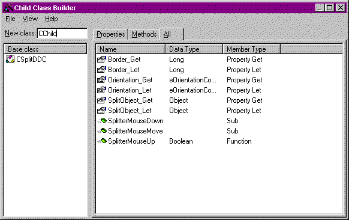



## Child Class Builder Utility

### Description

Don't wait for VB7 to start inheriting. Inheritance is a cornerstone of object-oriented programming, and VB6 supports it already (sort of).

The Child Class Builder Utility is a VB6 add-in that will create child-classes from existing ones. Learn interface inheritance, or save yourself hours of mind-numbing hand implementation.

Supports polymorphism to the full extent supported by VB.

Includes a brief article on how Interface Inheritance works.

Looks and feels like the VB6 Class Builder Utility.

Makes hundreds of Julienne fries.
 
### More Info
 

             |
---                |---
**Submitted On**   |2001-04-27 10:22:56
**By**             |[Mel Grubb II](https://github.com/Planet-Source-Code/PSCIndex/blob/master/ByAuthor/mel-grubb-ii.md)
**Level**          |Advanced
**User Rating**    |5.0 (35 globes from 7 users)
**Compatibility**  |VB 6\.0
**Category**       |[Complete Applications](https://github.com/Planet-Source-Code/PSCIndex/blob/master/ByCategory/complete-applications__1-27.md)
**World**          |[Visual Basic](https://github.com/Planet-Source-Code/PSCIndex/blob/master/ByWorld/visual-basic.md)
**Archive File**   |[Child Clas188804272001\.zip](https://github.com/Planet-Source-Code/mel-grubb-ii-child-class-builder-utility__1-22744/archive/master.zip)

